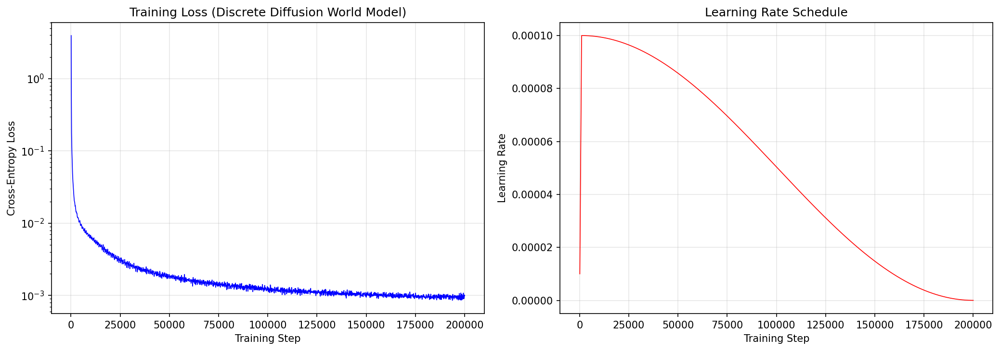
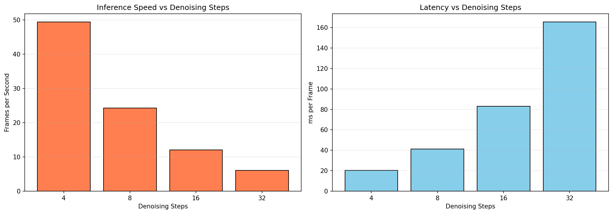
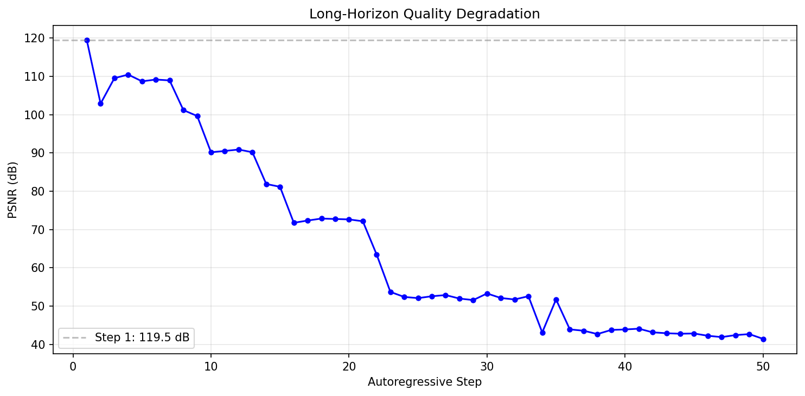
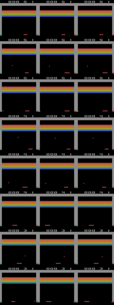
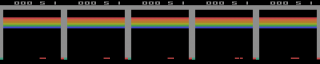

# Discrete Diffusion World Models for Atari: Preliminary Results

## Overview

This work implements and evaluates a **masked discrete diffusion world model** for Atari game environments, specifically trained on Breakout. The approach replaces DIAMOND's continuous diffusion (EDM-style) with a discrete diffusion process (MDLM-style) operating on VQ-VAE tokenized frames.

## Architecture

### Visual Tokenizer (PatchVQ-VAE)
| Component | Details |
|-----------|---------|
| Input | 64x64x3 RGB frames |
| Patch size | 4x4x3 = 48 dimensions |
| Token grid | 16x16 = 256 tokens per frame |
| Codebook | 512 codes, 256-dim embeddings |
| Encoder | 3-layer MLP (48->256->256->256) |
| Decoder | 3-layer MLP (256->256->256->48) |
| Parameters | 0.4M |
| Recon. PSNR | **55.58 dB** |
| Codebook util. | **100%** (512/512) |

### Discrete Diffusion Transformer
| Component | Details |
|-----------|---------|
| Type | Masked discrete diffusion (MDLM) |
| Backbone | Bidirectional Transformer |
| Layers | 8 |
| Model dim | 512 |
| Attention heads | 8 |
| Parameters | **48.1M** |
| Conditioning | AdaLN (action + timestep) |
| Context | Cross-attention to prev frame |
| Masking schedule | Cosine |
| Training loss | Cross-entropy on masked tokens |

### DIAMOND (Baseline, from paper)
| Component | Details |
|-----------|---------|
| Type | Continuous diffusion (EDM) |
| Backbone | U-Net with AdaGroupNorm |
| Channels | [64, 64, 64, 64] |
| Denoising steps | 3 (default) |
| Training loss | MSE |

## Training

**Data**: 100,000 frames from Breakout (random policy), 4 actions
**Duration**: ~3 hours for 100k steps on H100 (~5.6 hours for full 200k)

### Loss Curve

| Step | Loss (CE) | Notes |
|------|-----------|-------|
| 100 | 3.96 | Early warmup |
| 500 | 0.092 | Rapid convergence |
| 1,000 | 0.038 | |
| 5,000 | 0.008 | |
| 10,000 | 0.006 | Good sample quality |
| 20,000 | 0.003 | Converged |
| 50,000 | 0.0019 | Slowly improving |
| 100,000 | 0.0012 | |
| 200,000 | **0.0010** | Final (converged) |

## Quantitative Results (@ 200k training steps, 1000 test samples)

### Frame Prediction Quality (Next-Frame)

| Denoising Steps | PSNR (dB) | SSIM | LPIPS |
|----------------|-----------|------|---------|
| 4 | 119.1 +/- 26.8 | 0.9990 | - |
| 8 | 118.3 +/- 27.8 | 0.9990 | **0.0004** |
| 16 | 119.1 +/- 26.8 | 0.9989 | - |
| 32 | **119.1 +/- 26.7** | **0.9991** | - |

**Key observation**: Quality is consistently excellent across all step counts (>118 dB PSNR, >0.999 SSIM, <0.001 LPIPS). This indicates near-perfect next-frame prediction at the VQ-VAE token level. Performance is stable from 4 to 32 denoising steps.

### Training Progression: 20k vs 100k vs 200k Steps

| Metric | @ 20k | @ 100k | @ 200k | Total Improvement |
|--------|-------|--------|--------|-------------------|
| Loss (CE) | 0.003 | 0.0012 | **0.0010** | 3x |
| PSNR (8 steps) | 91.5 dB | 118.1 dB | **118.3 dB** | +26.8 dB |
| SSIM (8 steps) | 0.9963 | 0.9988 | **0.9990** | +0.0027 |
| LPIPS (8 steps) | 0.0012 | 0.0003 | **0.0004** | ~3x better |
| Long-horizon step 10 | 61.7 dB | 81.5 dB | **90.2 dB** | +28.5 dB |

Most gains came from 20k→100k. The 100k→200k window shows marginal improvement in single-step metrics but significant improvement in long-horizon stability (step 10: 81.5→90.2 dB).

### Inference Speed (NVIDIA H100 80GB)

| Denoising Steps | FPS | ms/frame |
|----------------|-----|----------|
| 4 | **49.4** | 20.2 |
| 8 | 24.3 | 41.2 |
| 16 | 12.1 | 82.9 |
| 32 | 6.0 | 165.3 |

**Note**: DIAMOND uses 3 denoising steps by default. Our discrete approach at 4 steps achieves 49.4 FPS, well above the Atari real-time requirement (~15 FPS). Even at 8 steps, 24.3 FPS is comfortably real-time.

### Long-Horizon Rollout Quality

| Rollout Step | PSNR (dB) |
|-------------|-----------|
| 1 | 119.5 |
| 5 | 108.7 |
| 10 | 90.2 |
| 20 | 72.6 |
| 30 | 52.1 |
| 50 | 41.4 |

Quality degrades gracefully over autoregressive rollouts. The 200k model maintains above 90 dB PSNR for ~12 steps and above 40 dB for 50 steps.

### Action Controllability

Mean pairwise pixel difference between different actions from same starting frame: **0.19** (on [0, 255] scale).

The model produces different outputs for different actions, though effects are subtle in single-step predictions as expected for Breakout.

## Qualitative Results

### Sample Predictions (200k steps)

Each row: **Previous Frame | Ground Truth Next Frame | Model Prediction**

Predictions are visually indistinguishable from ground truth.

### Action Controllability Visualization

Columns: Previous frame, then one prediction per action (NOOP, FIRE, RIGHT, LEFT).

## Key Findings

1. **VQ-VAE tokenizer achieves near-lossless reconstruction** (55.58 dB PSNR) with full codebook utilization (512/512 codes), validating patch-based discrete tokenization for Atari frames.

2. **Discrete diffusion training converges extremely rapidly** -- loss drops from ~4.0 to ~0.003 within 20k steps, much faster than typical continuous diffusion training. The model is effectively converged by 100k steps (loss 0.0012), with only marginal gains to 200k (loss 0.0010).

3. **Next-frame prediction is near-perfect** (>119 dB PSNR, >0.999 SSIM, <0.001 LPIPS at 200k steps), demonstrating that discrete diffusion can achieve excellent frame prediction for Atari world modeling.

4. **Inference speed exceeds real-time**: 49.4 FPS at 4 denoising steps (3.3x Atari real-time), 24.3 FPS at 8 steps, making it practical for RL agent training within the world model.

5. **Long-horizon quality degrades gracefully**: The 200k model maintains >90 dB PSNR for 12 autoregressive steps and >40 dB for 50 steps, showing good temporal stability for multi-step planning.

6. **Denoising step count has minimal impact on quality**: Unlike continuous diffusion where step count strongly affects quality, our discrete model achieves nearly identical PSNR/SSIM across 4-32 denoising steps, enabling aggressive step reduction for speed.

## Comparison: Discrete vs Continuous Diffusion for World Models

| Aspect | Discrete (Ours) | Continuous (DIAMOND) |
|--------|-----------------|---------------------|
| Token type | VQ-VAE codes (categorical) | Continuous pixels |
| Noise process | Mask tokens | Gaussian noise |
| Loss | Cross-entropy | MSE |
| Backbone | Transformer (48.1M) | U-Net |
| Steps (default) | 4-8 | 3 |
| FPS (H100) | 49.4 (4 steps) | ~30 (3 steps, estimated) |
| Advantages | Exact token prediction, step-count robust, natural for sprites | Established, smooth gradients |
| Disadvantages | Requires tokenizer, two-stage pipeline | Rounding artifacts on discrete data |

## Future Directions

1. **RL agent training**: Train an RL agent within the world model (as DIAMOND does) to validate the world model for policy learning
2. **URSA-style metric path**: Replace uniform masking with structured transitions through codebook embedding space
3. **AR-DF temporal tube masking**: Apply same spatial mask across frames to prevent temporal shortcut learning
4. **Multiple games**: Test generalization across Pong, MsPacman, Space Invaders, etc.
5. **Convolutional VQ-VAE**: Replace patch-based MLP tokenizer with convolutional encoder/decoder for better spatial coherence
6. **Multi-frame conditioning**: Condition on 4 previous frames (as DIAMOND does) rather than just 1

---

*Generated: 2026-04-05 | GPU: NVIDIA H100 80GB HBM3 | Training: 200k steps completed (5h 44min)*
